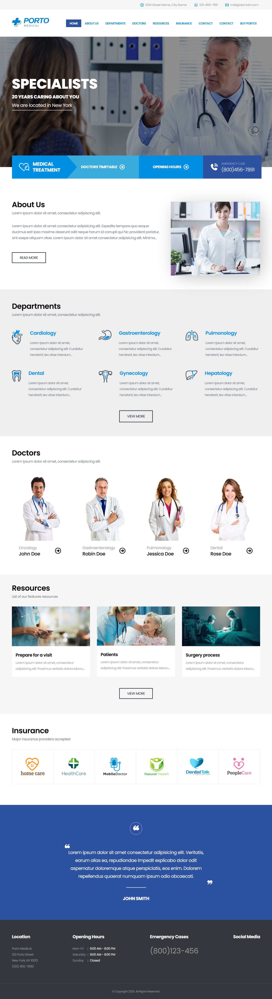

# porto-medical-static-clone

A fully static, mobile-responsive replica of the **[Porto Medical WordPress Demo](https://www.portotheme.com/wordpress/porto/medical/)**. Built with clean HTML and CSS for easy reuse and deployment.

## Sections Included

-  Hero section with emergency contact, appointment button, and opening hours
-  About Us
-  Departments (Cardiology, Gastroenterology, Pulmonology, Dental, Gynecology, Hepatology)
-  Doctors profiles
-  Resources (Prepare for visit, Patients, Surgery process)
-  Insurance logos
-  Footer with contact details and testimonials

## Usage

1. Clone the repository
2. Open `index.html` in your browser
3. Modify section content or styles as needed
4. Deploy to any static host

## Original Template

This static clone is based on the **[Porto Medical Demo](https://www.portotheme.com/wordpress/porto/medical/)** by [Porto Theme](https://www.portotheme.com/wordpress/porto/).
